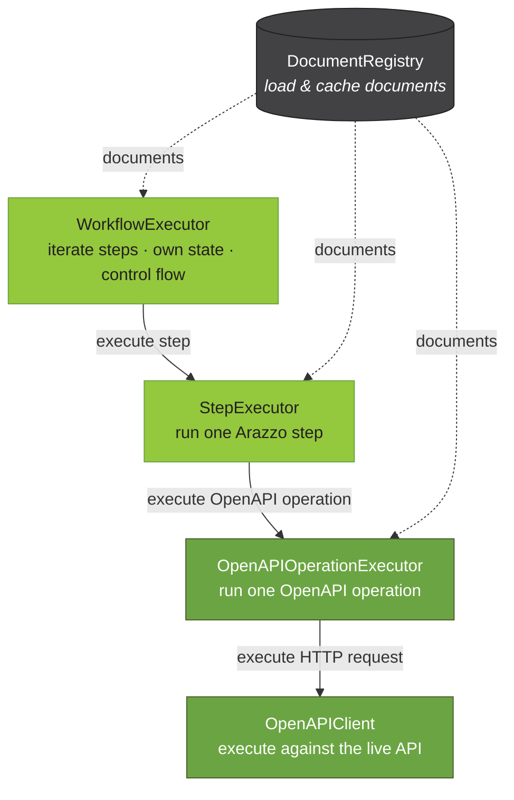

# @usearazzo/runner

> [!WARNING]
> This package is under heavy development and is not yet published to npm. It is developed within the [`arazzo-toolkit`](https://github.com/usearazzo/arazzo-toolkit) monorepo and will be publicly installable once its API stabilizes; until then, APIs may change without notice.

`@usearazzo/runner` executes [Arazzo Specification](https://spec.openapis.org/arazzo/latest.html) workflows against live APIs described by [OpenAPI Specification](https://spec.openapis.org/oas/latest.html) source descriptions.
It builds on [SpecLynx ApiDOM](https://github.com/speclynx/apidom) data models and reuses the loading, resolution, and normalization primitives shared across [`@usearazzo/parser`](https://www.npmjs.com/package/@usearazzo/parser) and [`@usearazzo/resolver`](https://www.npmjs.com/package/@usearazzo/resolver).

**Supported Arazzo versions:**

- [Arazzo 1.0.0](https://spec.openapis.org/arazzo/v1.0.0)
- [Arazzo 1.0.1](https://spec.openapis.org/arazzo/v1.0.1)

**Supported OpenAPI versions (for source descriptions):**

- [OpenAPI 2.0](https://spec.openapis.org/oas/v2.0)
- [OpenAPI 3.0.x](https://spec.openapis.org/oas/v3.0.4)
- [OpenAPI 3.1.x](https://spec.openapis.org/oas/v3.1.2)

## Architecture

Running an Arazzo workflow is a pipeline of small, single-responsibility building blocks organized into four main components:

- **`DocumentRegistry`** — loads and caches the Arazzo entry document and its OpenAPI source descriptions, so each is fetched and parsed once.
- **`WorkflowExecutor`** — iterates a workflow's steps, owns the run state, and interprets control-flow actions (`goto`, `retry`, `end`).
- **`StepExecutor`** — runs a single Arazzo step: locates its operation, resolves inputs, evaluates criteria and outputs, and selects the next action.
- **`OpenAPIOperationExecutor`** — runs a single OpenAPI operation and returns its raw response; the Arazzo-agnostic seam between the runner and any `OpenAPIClient`.



Each layer reads run state but never mutates it — the `WorkflowExecutor` is the single writer that records outputs and interprets the returned control-flow action.

## `DocumentRegistry`

Loads and caches Arazzo and OpenAPI documents, so a source description referenced by many steps is fetched and parsed once.

```js
import { DocumentRegistry } from '@usearazzo/runner';

const registry = new DocumentRegistry();

// the entry Arazzo document.
const arazzoDoc = await registry.acquireEntryDocument(
  'https://ui.usearazzo.com/petstore-order-workflow.arazzo.yaml',
);

// a source description, resolved by name to an absolute URI, then acquired.
const uri = arazzoDoc.resolveSourceDescriptionURI('petstoreAPI');
const openapiDoc = await registry.acquire(uri);

registry.clear(); // drop cached documents to reclaim memory
```

## `WorkflowExecutor`

> [!NOTE]
> Under active development. The backbone below works today; sub-workflow calls, `dependsOn`, and step-level `goto` to a workflow are not yet implemented and throw `ExecutionError` rather than behaving incorrectly (see [Not yet supported](#not-yet-supported)).

`WorkflowExecutor` is the stateful orchestrator that runs a whole workflow. It iterates a workflow's steps in list order, calling `StepExecutor` per step, and owns the run state (a `WorkflowExecutionState`) that accumulates each step's outputs so later steps can read `$steps.*.outputs`. It interprets the control-flow actions `StepExecutor` only _selects_ — advancing to the next step, jumping via `goto`, or stopping on `end` / the failure break-default — supplies each step the workflow-level default `successActions` / `failureActions`, and resolves the workflow's `outputs` against the final state.

Give it the entry document, registry, and a `StepExecutor` once; call `execute` per run with a `workflowId` and its `inputs`:

```js
import {
  DocumentRegistry,
  OpenAPIOperationExecutor,
  StepExecutor,
  WorkflowExecutor,
  OpenAPIClientSwagger,
} from '@usearazzo/runner';

const registry = new DocumentRegistry();
const arazzoDoc = await registry.acquireEntryDocument(
  'https://ui.usearazzo.com/petstore-order-workflow.arazzo.yaml',
);

// compose the engines bottom-up: operation executor → step executor → workflow
// executor. Each takes its collaborator rather than building one, so a stub
// drops in for tests at any layer.
const operationExecutor = new OpenAPIOperationExecutor({
  clientFactory: (document) => new OpenAPIClientSwagger(document),
});
const stepExecutor = new StepExecutor({ document: arazzoDoc, registry, operationExecutor });
const executor = new WorkflowExecutor({ document: arazzoDoc, registry, stepExecutor });

const result = await executor.execute(
  'authenticateAndOrderPet',
  { username: 'user1', password: 'secret', preferredPetStatus: 'available' },
  { contextUrl: 'https://petstore3.swagger.io' },
);

console.log(result.status); // 'completed' | 'ended' | 'failed'
console.log(result.outputs); // workflow $outputs, resolved against final state
console.log(result.steps); // trace: each step's id, success, and selected action, in run order
```

The run state is created fresh per `execute` call and owned internally; the returned `result` is read-only. Every layer takes its collaborator rather than building one — `WorkflowExecutor` takes a `StepExecutor`, which takes an `OpenAPIOperationExecutor`, which takes the client factory — so each stays agnostic to how the layer beneath it reaches the live API, and a deterministic stub drops in for tests at any level.

### Control flow

After each step, the selected `onSuccess` / `onFailure` action determines what happens next:

- **no matching action** — success falls through to the next step; failure _breaks and returns_ (`status: 'failed'`);
- **`end`** — stops the run early with `status: 'ended'`, returning the outputs accumulated so far;
- **`goto` a `stepId`** — jumps to that step within the current workflow;
- **`retry`** — re-runs the step's operation up to the action's `retryLimit` (default `1`), waiting `retryAfter` seconds between attempts. Per spec, `retryLimit` is exhausted _before_ subsequent failure actions run, so an exhausted `retry` falls through to the next matching failure action — which may be another `retry` with its own independent budget, or a terminal `end` / `goto`; if none remains, the break-default applies. Each step's `attempts` count is surfaced in the result trace.

A runaway `goto` loop **or** a runaway `retry` is bounded by `maxSteps` (default `1000`), which counts every operation execution — each step attempt, including retries — and throws `ExecutionError` (`reason: 'step-budget'`) when exceeded. The `retryAfter` delay uses an injectable `sleep` (`WorkflowExecutorOptions.sleep`, default a real timer) so tests can run without waiting.

### Workflow-level default actions

A workflow's `successActions` / `failureActions` apply to every step as a **default**. A step that declares its own `onSuccess` / `onFailure` **overrides** the corresponding workflow list wholesale — there is no per-action merge, and success and failure fall back independently (a step may override only its failure actions and still inherit the workflow's success actions).

### Authoring errors vs. failed runs

Same split as `StepExecutor`: a step whose `successCriteria` go unmet with no redirecting action is a normal `status: 'failed'` result, **not** a throw. Only authoring errors throw `ExecutionError` — an unknown `workflowId` (`workflow-not-found`), a `goto` to a step that does not exist (`goto-target-not-found`), a `goto` naming neither `stepId` nor `workflowId` (`goto-target-missing`), an action of an unknown `type` (`unknown-action-type`), a present but malformed `steps` (`malformed-steps`), or the step-budget overflow above (`step-budget`).

### Not yet supported

These land in later work. Each throws `ExecutionError` (with the noted `reason`) rather than behaving incorrectly — except workflow-level `parameters`, which is simply not read yet:

- **sub-workflow steps** — a step targeting a `workflowId`, i.e. calling another workflow (`reason: 'workflow-step-unsupported'`). Recursion, sub-workflow cycle detection, and a nesting-depth guard land with this;
- **`dependsOn`** — running the workflows a workflow depends on before its own steps;
- **step-level `goto` to a `workflowId`** (`reason: 'goto-workflow-unsupported'`);
- **a `retry` carrying a `stepId` / `workflowId` reference** to run before retrying (`reason: 'retry-reference-unsupported'`);
- **cross-document workflow references** — a `workflowId` / `dependsOn` naming a workflow in another document via `$sourceDescriptions.<name>.<workflowId>` (`reason: 'cross-document-workflow-unsupported'`); same-document only for now;
- **workflow-level `parameters`** — a workflow's `parameters` applied to all its steps (they are not read yet).

## `StepExecutor`

Executes a single Arazzo step that invokes an OpenAPI operation, returning its outcome. It orchestrates the full per-step pipeline:

1. locate the step's operation (`operationId` or `operationPath`);
2. resolve the step's `parameters` and `requestBody` against the pre-request context (`$inputs`, `$steps.*.outputs`, …);
3. delegate the call to `OpenAPIOperationExecutor`;
4. evaluate `successCriteria`, resolve `outputs`, and select the `onSuccess` / `onFailure` action against the post-request context (`$statusCode`, `$response.*`, `$request.*`, `$url`, `$method`).

`StepExecutor` **reads run state and mutates nothing** — it returns the resolved outputs and the selected action for the caller to record and interpret. A step targeting a `workflowId` (a sub-workflow) is not an operation step and throws; running sub-workflows is the `WorkflowExecutor`'s concern.

It delegates the located operation to an injected `OpenAPIOperationExecutor` (below) rather than building one, so it stays agnostic to the operation pipeline and HTTP stack:

```js
import {
  DocumentRegistry,
  ArazzoWorkflowExtractor,
  ArazzoStepExtractor,
  WorkflowExecutionState,
  OpenAPIOperationExecutor,
  StepExecutor,
  OpenAPIClientSwagger,
} from '@usearazzo/runner';

const registry = new DocumentRegistry();
const arazzoDoc = await registry.acquireEntryDocument(
  'https://ui.usearazzo.com/petstore-order-workflow.arazzo.yaml',
);

// pull a step out of the loaded Arazzo document by workflow + step id.
const workflow = new ArazzoWorkflowExtractor().extract(arazzoDoc, 'authenticateAndOrderPet');
const step = new ArazzoStepExtractor().extract(workflow, 'findAvailablePets');

const operationExecutor = new OpenAPIOperationExecutor({
  clientFactory: (document) => new OpenAPIClientSwagger(document),
});
const executor = new StepExecutor({ document: arazzoDoc, registry, operationExecutor });

// run state carries $inputs and accumulates $steps.*.outputs across a run.
const state = new WorkflowExecutionState({ inputs: { preferredPetStatus: 'available' } });

const outcome = await executor.execute(step, state, {
  contextUrl: 'https://petstore3.swagger.io',
});

console.log(outcome.successful); // true when every successCriterion passed
console.log(outcome.outputs); // resolved step outputs, keyed by name
console.log(outcome.action); // the selected onSuccess / onFailure action, or undefined

// a caller records the outputs so a later step can read $steps.findAvailablePets.outputs.*
state.setStepOutputs(outcome.stepId, outcome.outputs);
```

### Authoring errors vs. failed steps

The two are deliberately distinct:

- A **received response with unmet criteria** is a normal outcome — `successful: false`, no throw.
- **Malformed input** throws an `ExecutionError` (a step with no operation target, more than one mutually-exclusive target, a `workflowId` step, or an operation that cannot be located).

## `OpenAPIOperationExecutor`

Executes a single OpenAPI operation and returns its raw response. It is **Arazzo-agnostic**: it neither locates the operation nor resolves runtime expressions. Given a canonical locator (`{ document, jsonPointer }`) it extracts the operation from its owning document, normalizes it, assembles a minimal standalone OpenAPI document containing just that operation, builds a client for the assembled document, and executes it.

`OpenAPIOperationExecutor` is the seam between the runner and any OpenAPI client implementation. It builds its client through the injected `clientFactory`, so a different HTTP stack (or a deterministic stub in tests) can be dropped in without touching the runner.

Because it is Arazzo-agnostic, it can be used **standalone** — with only an OpenAPI document and an `operationId`, no Arazzo workflow involved. The operation index on the loaded document maps an `operationId` to its JSON Pointer, which is all a locator needs:

```js
import {
  DocumentRegistry,
  OpenAPIOperationExecutor,
  OpenAPIClientSwagger,
} from '@usearazzo/runner';

const registry = new DocumentRegistry();
const openapiDoc = await registry.acquire('https://petstore3.swagger.io/api/v3/openapi.json');

// build a canonical { document, jsonPointer } locator straight from the OpenAPI
// document — the operation index resolves an operationId to its JSON Pointer.
const locator = {
  document: openapiDoc,
  jsonPointer: openapiDoc.operationIndex.get('findPetsByStatus'),
};

const executor = new OpenAPIOperationExecutor({
  clientFactory: (document) => new OpenAPIClientSwagger(document),
});

const response = await executor.execute(locator, {
  parameters: { status: 'available' },
  contextUrl: 'https://petstore3.swagger.io', // base URL for the operation's relative server
});

console.log(response.status, response.body);
```

A non-2xx response is returned as data, not thrown — whether it counts as success is judged (by a step's `successCriteria`) one level up. Malformed input (an unlocatable operation, an unsupported OpenAPI version) throws, as do genuine transport failures surfaced by the client (`OpenAPIClientSwagger` raises a `ClientError` when no response comes back at all).
