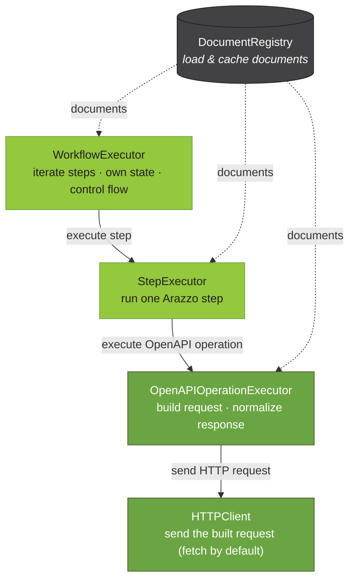

# @usearazzo/runner

> [!WARNING]
> This package is under heavy development and is not yet published to npm. It is
> developed within the [`arazzo-toolkit`](https://github.com/usearazzo/arazzo-toolkit) monorepo and
> will be publicly installable once its API stabilizes; until then, APIs may change without notice.

`@usearazzo/runner` executes [Arazzo Specification](https://spec.openapis.org/arazzo/latest.html)
workflows against live APIs described by
[OpenAPI Specification](https://spec.openapis.org/oas/latest.html) source descriptions. It builds on
[SpecLynx ApiDOM](https://github.com/speclynx/apidom) data models and reuses the loading,
resolution, and normalization primitives shared across
[`@usearazzo/parser`](https://www.npmjs.com/package/@usearazzo/parser) and
[`@usearazzo/resolver`](https://www.npmjs.com/package/@usearazzo/resolver).

**Supported Arazzo versions:**

- [Arazzo 1.0.0](https://spec.openapis.org/arazzo/v1.0.0)
- [Arazzo 1.0.1](https://spec.openapis.org/arazzo/v1.0.1)

**Supported OpenAPI versions (for source descriptions):**

- [OpenAPI 2.0](https://spec.openapis.org/oas/v2.0)
- [OpenAPI 3.0.x](https://spec.openapis.org/oas/v3.0.4)
- [OpenAPI 3.1.x](https://spec.openapis.org/oas/v3.1.2)

## Architecture

Running an Arazzo workflow is a pipeline of small, single-responsibility building blocks organized
into four main components:

- **`DocumentRegistry`**: loads and caches the Arazzo entry document and its OpenAPI source
  descriptions, so each is fetched and parsed once.
- **`WorkflowExecutor`**: iterates a workflow's steps, owns the run state, and interprets
  control-flow actions (`goto`, `retry`, `end`).
- **`StepExecutor`**: runs a single Arazzo step: locates its operation, resolves inputs, evaluates
  criteria and outputs, and selects the next action.
- **`OpenAPIOperationExecutor`**: runs a single OpenAPI operation: builds the HTTP request
  (parameter serialization, securities, server resolution), sends it through the pluggable
  `HTTPClient` transport, and normalizes the raw response into the runner's response model.



Each layer reads run state but never mutates it. The `WorkflowExecutor` is the single writer that
records outputs and interprets the returned control-flow action.

## `DocumentRegistry`

Loads and caches Arazzo and OpenAPI documents, so a source description referenced by many steps is
fetched and parsed once.

```js
import { DocumentRegistry } from '@usearazzo/runner';

const registry = new DocumentRegistry();

// the entry Arazzo document.
const arazzoDoc = await registry.acquireEntryDocument(
  'https://ui.usearazzo.com/petstore-order-workflow.arazzo.yaml',
);

// a source description, resolved by name to an absolute URI, then acquired.
const uri = arazzoDoc.resolveSourceDescriptionURI('petstoreAPI');
const openapiDoc = await registry.acquire(uri);

registry.clear(); // drop cached documents to reclaim memory
```

## `WorkflowExecutor`

> [!NOTE]
> Under active development. Step-level `goto` to a workflow, a `retry` carrying a reference, and
> cross-document workflow references are not yet implemented and throw `ExecutionError` rather than
> behaving incorrectly (see [Not yet supported](#not-yet-supported)).

`WorkflowExecutor` is the stateful orchestrator that runs a whole workflow. It iterates a workflow's
steps in list order, calling `StepExecutor` per step, and owns the run state (a
`WorkflowExecutionState`) that accumulates each step's outputs so later steps can read
`$steps.*.outputs`. It interprets the control-flow actions `StepExecutor` only _selects_ (advancing
to the next step, jumping via `goto`, or stopping on `end` or the failure break-default), supplies
each step the workflow-level default `successActions` / `failureActions`, and resolves the
workflow's `outputs` against the final state.

Give it the entry document, registry, and a `StepExecutor` once; call `execute` per run with a
`workflowId` and its `inputs`:

```js
import {
  DocumentRegistry,
  OpenAPIOperationExecutor,
  StepExecutor,
  WorkflowExecutor,
} from '@usearazzo/runner';

const registry = new DocumentRegistry();
const arazzoDoc = await registry.acquireEntryDocument(
  'https://ui.usearazzo.com/petstore-order-workflow.arazzo.yaml',
);

// compose the engines bottom-up: operation executor → step executor → workflow
// executor. Each takes its collaborator rather than building one, so a stub
// drops in for tests at any layer. The operation executor sends requests
// through global fetch by default; pass { httpClient } to swap the transport.
const operationExecutor = new OpenAPIOperationExecutor();
const stepExecutor = new StepExecutor({ document: arazzoDoc, registry, operationExecutor });
const executor = new WorkflowExecutor({ document: arazzoDoc, registry, stepExecutor });

const result = await executor.execute('authenticateAndOrderPet', {
  inputs: {
    username: 'user1',
    password: 'secret',
    preferredPetStatus: 'available',
  },
});

console.log(result.status); // 'completed' | 'ended' | 'failed'
console.log(result.outputs); // workflow $outputs, resolved against final state
console.log(result.steps); // trace: each step's id, success, action, attempts, durationMs
console.log(result.durationMs); // elapsed time for the whole run
```

`execute` takes the workflowId and an options bag:

| option             | meaning                                                                              |
| ------------------ | ------------------------------------------------------------------------------------ |
| `inputs`           | the workflow's inputs, read via `$inputs`                                            |
| `executeOptions`   | opaque bag forwarded to every step's operation (e.g. `server`, `requestInterceptor`) |
| `dependencyInputs` | inputs for workflows run to satisfy `dependsOn`, keyed by workflowId                 |
| `runDependencies`  | run this workflow's `dependsOn` workflows first (default `true`)                     |
| `signal`           | an `AbortSignal` cancelling the run (see [Cancellation](#cancellation))              |

The run state is created fresh per `execute` call and owned internally; the returned `result` is
read-only. Every layer takes its collaborator rather than building one: `WorkflowExecutor` takes a
`StepExecutor`, which takes an `OpenAPIOperationExecutor`, which takes the `httpClient` transport.
Each therefore stays agnostic to how the layer beneath it reaches the live API, and a deterministic
stub drops in for tests at any level.

### Control flow

After each step, the selected `onSuccess` / `onFailure` action determines what happens next:

- **no matching action**: success falls through to the next step; failure _breaks and returns_
  (`status: 'failed'`);
- **`end`**: stops the run early with `status: 'ended'`, returning the outputs accumulated so far;
- **`goto` a `stepId`**: jumps to that step within the current workflow;
- **`retry`**: re-runs the step's operation up to the action's `retryLimit` (default `1`), waiting
  `retryAfter` seconds between attempts. Per spec, `retryLimit` is exhausted _before_ subsequent
  failure actions run, so an exhausted `retry` falls through to the next matching failure action,
  which may be another `retry` with its own independent budget or a terminal `end` or `goto`. If
  none remains, the break-default applies. Each step's `attempts` count is surfaced in the result
  trace.

A runaway `goto` loop, a runaway `retry`, **or** a runaway tree of sub-workflow calls is bounded by
`maxSteps` (default `1000`), which counts every step attempt and throws `ExecutionError`
(`reason: 'step-budget'`) when exceeded. The budget is shared by the whole call tree rather than
granted afresh per workflow, so a sub-workflow cannot escape the ceiling the caller set; the error
carries the offending `path` (the chain of workflowIds in progress). The `retryAfter` delay uses an
injectable `sleep` (`WorkflowExecutorOptions.sleep`, default a real timer) so tests can run without
waiting, and `durationMs` uses an injectable `now` (default the monotonic `performance.now`) so
they can assert timings.

### Composing workflows

A step targeting a `workflowId` calls another workflow. Its `parameters` become that workflow's
inputs (mapped by `name` — such a step's parameters carry no `in`), the sub-run is recorded under
`$workflows.<id>`, and the step's own `outputs` and `successCriteria` are then resolved against that
updated state. A sub-run that ends `failed` puts the step on its failure path, so `onFailure` —
including `retry`, which re-runs the whole sub-workflow — applies exactly as for an operation step.

A workflow's `dependsOn` workflows are run to completion before its own steps. Each one's outputs
become readable as `$workflows.<id>.outputs`; they are not merged into the dependent's own outputs.
A dependency already completed in the same run is not run again, so a diamond does not duplicate its
side effects. Because the specification gives `dependsOn` no input-mapping mechanism, a dependency
that needs inputs takes them from the caller's `dependencyInputs` map; pass `runDependencies: false`
to assert they were already satisfied out-of-band. That assertion covers the workflow you name and
no more — a sub-workflow it calls still runs its own prerequisites, which the caller may not know
exist. A dependency that fails makes the run `failed` without executing any of its own steps.

Both recurse through one guarded call tree. Re-entering a workflow already in progress throws
(`reason: 'workflow-cycle'`, or `'dependsOn-cycle'` when every edge closing the loop is a dependency
edge), carrying the offending `path`; nesting past `maxWorkflowDepth` (default `32`, counting the
workflow `execute` was called with) throws `reason: 'workflow-depth'`. A diamond is not a cycle: a
workflow that completed and unwound may be entered again.

The result mirrors this structure. A step record carries `subWorkflows` — one nested
`WorkflowExecutionResult` per attempt, so a retried sub-workflow step keeps every attempt's trace —
and a result carries `dependencies`, the prerequisite runs in declaration order.

### Workflow-level default actions

A workflow's `successActions` / `failureActions` apply to every step as a **default**. A step that
declares its own `onSuccess` / `onFailure` **overrides** the corresponding workflow list wholesale.
There is no per-action merge, and success and failure fall back independently (a step may override
only its failure actions and still inherit the workflow's success actions).

### Cancellation

Pass an `AbortSignal` as `signal` to cancel a run:

```js
const controller = new AbortController();
setTimeout(() => controller.abort(), 5_000);

const result = await executor.execute('authenticateAndOrderPet', {
  inputs: { username: 'user1', password: 'secret' },
  signal: controller.signal,
});
```

The signal is observed at every boundary in the call tree — before each step, before each **retry
attempt** of a step, before entering a sub-workflow or a `dependsOn` prerequisite — and during the
`retryAfter` waits between attempts, which the default timer cuts short rather than sitting out. It
is also forwarded to the transport, so the request in flight when the abort lands is cancelled
rather than merely awaited (the `HTTPClient` contract asks every transport to honor
`request.signal` — global fetch does it for free, since the request doubles as fetch init; an axios
or undici client passes `request.signal` through in one line). A transport that ignores it costs
one in-flight request: the run still stops at the next boundary.

An aborted run throws `ExecutionError` with `reason: 'aborted'`, naming the boundary it stopped at
(`workflowId`, `stepId`, and the `path` of workflows in progress) and carrying the signal's own
`reason` as the error's `cause`. One shape covers every case: a transport that honors the signal
rejects the request it was told to drop, and that rejection is reported as the cancellation it is
rather than as the `ClientError` a request failing on its own terms would raise — so a run
cancelled mid-flight reads the same as one cancelled between two steps, whichever transport is
plugged in. It does **not** resolve as a `failed` result: cancellation is not
something the steps did, and the steps that never ran were not decided against by any criteria.

A `signal` passed through `executeOptions` instead — the only channel before this option existed —
cancels the run just the same; the first-class option wins when both are given. `StepExecutor`
honors a `signal` in its execute options when used on its own too, throwing `aborted` instead of
dispatching a request that would be cancelled on the wire.

### Authoring errors vs. failed runs

Same split as `StepExecutor`: a step whose `successCriteria` go unmet with no redirecting action is
a normal `status: 'failed'` result, **not** a throw — as is a run whose `dependsOn` workflow failed.
Authoring errors throw `ExecutionError` — as does a cancelled run (`aborted`, above): an unknown
`workflowId` (`workflow-not-found`), a `goto` to a step that does not exist
(`goto-target-not-found`), a `goto` naming neither `stepId` nor `workflowId`
(`goto-target-missing`), an action of an unknown `type` (`unknown-action-type`), a
present but malformed `steps` or `dependsOn` (`malformed-steps`, `malformed-dependsOn`), a step
naming more than one target (`ambiguous-target`), a cycle or over-deep nesting (`workflow-cycle`,
`dependsOn-cycle`, `workflow-depth`), or the step-budget overflow above (`step-budget`).

A workflow's own `steps` and `dependsOn` lists are validated before any of its prerequisites run, so
those two mistakes never fire live requests on the way to throwing. Errors belonging to an
individual step — a step naming two targets, a `goto` to a step that does not exist, an unknown
action `type` — are raised when the run reaches that step, which means earlier steps have already
executed. That is deliberate: a bad step the run never reaches should not fail an otherwise valid
run.

### Not yet supported

These land in later work. Each throws `ExecutionError` (with the noted `reason`) rather than
behaving incorrectly, except workflow-level `parameters`, which is simply not read yet:

- **step-level `goto` to a `workflowId`** (`reason: 'goto-workflow-unsupported'`);
- **a `retry` carrying a `stepId` / `workflowId` reference** to run before retrying
  (`reason: 'retry-reference-unsupported'`);
- **cross-document workflow references**: a `workflowId` / `dependsOn` naming a workflow in another
  document via `$sourceDescriptions.<name>.<workflowId>`
  (`reason: 'cross-document-workflow-unsupported'`); same-document only for now;
- **workflow-level `parameters`**: a workflow's `parameters` applied to all its steps (they are not
  read yet).

## `StepExecutor`

Executes a single Arazzo step that invokes an OpenAPI operation, returning its outcome. It
orchestrates the full per-step pipeline:

1. locate the step's operation (`operationId` or `operationPath`);
2. resolve the step's `parameters` and `requestBody` against the pre-request context (`$inputs`,
   `$steps.*.outputs`, …);
3. delegate the call to `OpenAPIOperationExecutor`;
4. evaluate `successCriteria`, resolve `outputs`, and select the `onSuccess` / `onFailure` action
   against the post-request context (`$statusCode`, `$response.*`, `$request.*`, `$url`, `$method`).

`StepExecutor` **reads run state and mutates nothing**: it returns the resolved outputs and the
selected action for the caller to record and interpret. A step targeting a `workflowId` (a
sub-workflow) is not an operation step and throws; running sub-workflows is the `WorkflowExecutor`'s
concern.

It delegates the located operation to an injected `OpenAPIOperationExecutor` (below) rather than
building one, so it stays agnostic to the operation pipeline and HTTP stack:

```js
import {
  DocumentRegistry,
  ArazzoWorkflowExtractor,
  ArazzoStepExtractor,
  WorkflowExecutionState,
  OpenAPIOperationExecutor,
  StepExecutor,
} from '@usearazzo/runner';

const registry = new DocumentRegistry();
const arazzoDoc = await registry.acquireEntryDocument(
  'https://ui.usearazzo.com/petstore-order-workflow.arazzo.yaml',
);

// pull a step out of the loaded Arazzo document by workflow + step id.
const workflow = new ArazzoWorkflowExtractor().extract(arazzoDoc, 'authenticateAndOrderPet');
const step = new ArazzoStepExtractor().extract(workflow, 'findAvailablePets');

const operationExecutor = new OpenAPIOperationExecutor();
const executor = new StepExecutor({ document: arazzoDoc, registry, operationExecutor });

// run state carries $inputs and accumulates $steps.*.outputs across a run.
const state = new WorkflowExecutionState({ inputs: { preferredPetStatus: 'available' } });

const outcome = await executor.execute(step, state);

console.log(outcome.successful); // true when every successCriterion passed
console.log(outcome.outputs); // resolved step outputs, keyed by name
console.log(outcome.action); // the selected onSuccess / onFailure action, or undefined

// a caller records the outputs so a later step can read $steps.findAvailablePets.outputs.*
state.setStepOutputs(outcome.stepId, outcome.outputs);
```

### Authoring errors vs. failed steps

The two are deliberately distinct:

- A **received response with unmet criteria** is a normal outcome: `successful: false`, no throw.
- **Malformed input** throws an `ExecutionError` (a step with no operation target, more than one
  mutually-exclusive target, a `workflowId` step, or an operation that cannot be located).
- A **cancelled run** throws too (`reason: 'aborted'`): an `AbortSignal` passed as `signal` in the
  execute options is checked before the request is dispatched, so an already-aborted run does not
  send a request whose wire-level cancellation would then be judged like a refusal from the API.

## `OpenAPIOperationExecutor`

Executes a single OpenAPI operation and returns its normalized response. It is **Arazzo-agnostic**:
it neither locates the operation nor resolves runtime expressions. Given a canonical locator
(`{ document, jsonPointer }`) it runs a three-stage pipeline:

1. **build**: extracts the operation from its owning document, normalizes it, assembles a minimal
   standalone OpenAPI document containing just that operation, and builds the HTTP request from it:
   parameter serialization (style/explode), security application, and server resolution, across
   OpenAPI 2.0 through 3.1;
2. **send**: hands the built request to the pluggable `httpClient` transport (global fetch by
   default);
3. **normalize**: deserializes the raw WHATWG `Response` by content type into the runner's
   `OpenAPIOperationResponse`, the model runtime expressions and criteria see.

Because the executor builds the request explicitly and holds it, the response carries the request
**as actually sent** (`response.request`): final URL, method, headers, and serialized body. That way
`$url` / `$method` / `$request.*` are evaluated against reality, not intent.

A step's `requestBody` works the same against every supported version, including Swagger 2.0, which
has no request-body concept and carries the payload as a declared `body` or `formData` parameter
instead. Its `contentType` is matched ignoring case and media-type parameters, and a declared range
counts as covering a concrete type, so `application/json; charset=utf-8` names a declared
`application/json` and either names a declared `*/*`. The form media types are the exception, since
they decide how the body is encoded and so must be declared exactly. A `contentType` matching
nothing raises a `ClientError` rather than sending an empty or wrongly encoded body.

### Choosing the server

By default the request goes to the first server the operation declares (for Swagger 2.0, the
document's `schemes` + `host` + `basePath`), with a relative server resolved against the URL the
document itself was loaded from. That covers the common case with no options at all.

**`server`** changes where it goes, and does double duty:

```js
// selection: the value matches a declared server, so its variable defaults
// come along and only the ones you name are overridden
await executor.execute(locator, {
  server: 'https://{region}.example.com/{basePath}', // the raw template, as declared
  serverVariables: { region: 'us' }, // basePath keeps its declared default
});

// override: the value matches nothing declared, so it simply is the base URL
await executor.execute(locator, { server: 'https://staging.internal.test/api' });
```

There is deliberately **no silent fallback**: a `server` matching nothing declared is never quietly
swapped for the first declared one. The URL you name is the URL that gets called, so a typo fails
loudly at the network rather than succeeding against the wrong host. An override replaces the
declared base path along with the host, so include it (`…/api/v3`) if the API expects one.
Overriding works on Swagger 2.0 too; selection and `serverVariables` are 3.x-only, since 2.0 has no
server list and no URL templates.

Relative servers resolve against the URL the document was loaded from, which the executor already
knows, so a document fetched from `https://petstore3.swagger.io/api/v3/openapi.json` declaring
`servers: [{ url: '/api/v3' }]` needs no configuration at all. For a document loaded from disk, give
`server` an absolute URL.

### The `HTTPClient` seam

The transport is the extension point, and its contract is deliberately minimal: a function from the
built request to a WHATWG `Response`. The default, exported as `httpClientFetch`, is global fetch in
one line (`(request) => fetch(request.url, request)`) and is used when no `httpClient` is given:

```js
import { fetch, Agent } from 'undici';
import { OpenAPIOperationExecutor } from '@usearazzo/runner';

// the default transport, no configuration needed
const executor = new OpenAPIOperationExecutor();

// any HTTP stack drops in with a few lines: here undici with a dispatcher the
// global fetch cannot take (connection-pool tuning, a proxy, client certificates)
const dispatcher = new Agent({ connections: 128, keepAliveTimeout: 60_000 });

const pooledExecutor = new OpenAPIOperationExecutor({
  httpClient: (request) => fetch(request.url, { ...request, dispatcher }),
});

// or serve canned responses in a test: no network, no interception hooks
const offlineExecutor = new OpenAPIOperationExecutor({
  httpClient: async () =>
    new Response('[{"id":1,"status":"available"}]', {
      status: 200,
      headers: { 'content-type': 'application/json' },
    }),
});
```

`httpClientFetch` is exported so a transport that only wants to add behavior around the network call
can delegate to it rather than re-implement fetch.

The contract:

- resolve with a `Response` for **every** HTTP status: a non-2xx is a valid Arazzo outcome judged by
  a step's `successCriteria`, never an error;
- throw only on genuine transport failure: the executor wraps it as a `ClientError` carrying the
  original error as `cause`;
- honor `request.signal` when present.

Response normalization runs on the executor's side of the seam for every client, so `$response.body`
semantics stay identical no matter which transport is plugged in.

### Request decoration (and authentication)

Arazzo is auth-agnostic (a workflow document says nothing about credentials), so the runner does not
model authentication either. Credentials are applied by decorating the outgoing request with a
`requestInterceptor`, which runs after the request is built and before it is sent, may be
synchronous or asynchronous, and may mutate the request or return (or resolve with) a replacement:

```js
const executor = new OpenAPIOperationExecutor({
  requestInterceptor: async (request) => {
    request.headers.Authorization = `Bearer ${await acquireToken()}`;
  },
});
```

A per-call `requestInterceptor` can also ride in the execute options bag; it runs after the
executor-level one.

Because the interceptor sets headers directly, it works regardless of how (or whether) the OpenAPI
document declares its security schemes. If you'd rather have credentials applied _from_ those
declarations, placed in the header, query, or cookie each scheme prescribes, `buildRequest`'s
`securities` option still passes through the execute options bag untouched; it is simply not part of
the typed surface.

Decoration via the interceptor, rather than inside a custom `httpClient`, is what makes the edits
part of the request record: the executor captures `response.request` (which feeds `$request.*` and
the trace) after the interceptors run and before the transport is called, so transport-side changes
are deliberately invisible to it.

### Standalone use

Because it is Arazzo-agnostic, the executor can be used **standalone**: with only an OpenAPI
document and an `operationId`, no Arazzo workflow involved. The operation index on the loaded
document maps an `operationId` to its JSON Pointer, which is all a locator needs:

```js
import { DocumentRegistry, OpenAPIOperationExecutor } from '@usearazzo/runner';

const registry = new DocumentRegistry();
const openapiDoc = await registry.acquire('https://petstore3.swagger.io/api/v3/openapi.json');

// build a canonical { document, jsonPointer } locator straight from the OpenAPI
// document; the operation index resolves an operationId to its JSON Pointer.
const locator = {
  document: openapiDoc,
  jsonPointer: openapiDoc.operationIndex.get('findPetsByStatus'),
};

const executor = new OpenAPIOperationExecutor();

// the operation's relative server resolves against the URL the document was
// loaded from, so there is nothing to configure.
const response = await executor.execute(locator, { parameters: { status: 'available' } });

console.log(response.status, response.body);
console.log(response.request.url); // the URL as actually sent
```

A non-2xx response is returned as data, not thrown; whether it counts as success is judged one level
up, by a step's `successCriteria`. Everything else throws with a named reason: malformed input (an
unlocatable operation, an unsupported OpenAPI version), a request that cannot be built (e.g. a
missing required parameter), and transport failures. The latter two arrive as `ClientError`.
